# {Shan, Shui}\*

English | [中文](doc/README_zh.md)

Procedurally-understandably-generated vector-format infinitely-scrolling Chinese landscape for the browser.

This project is based on `react` framework, and use `typescript` to code.

Support downloading `svg` image of any range (without background).

The algorithm is based on page of [{Shan, Shui}\*](https://github.com/LingDong-/shan-shui-inf/blob/master/README.md#shan-shui) coded by [Lingdong Huang](https://github.com/LingDong-)

[TOC]

## Install

```shell
sudo apt-get install nodejs
npm install
```

## Usage

```shell
npm start
```

## Render Components

### man


### water

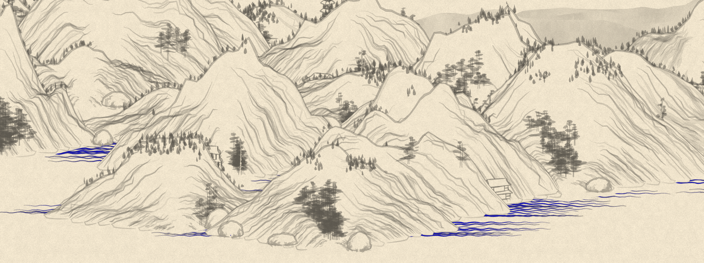

### architecture

#### arch01

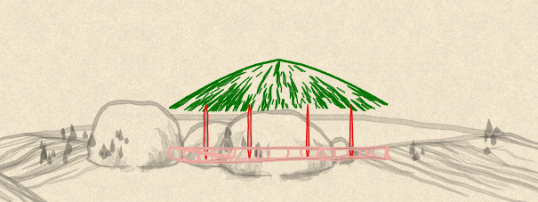

green - `hut`

red - `box`

pink - `rail`

#### arch02

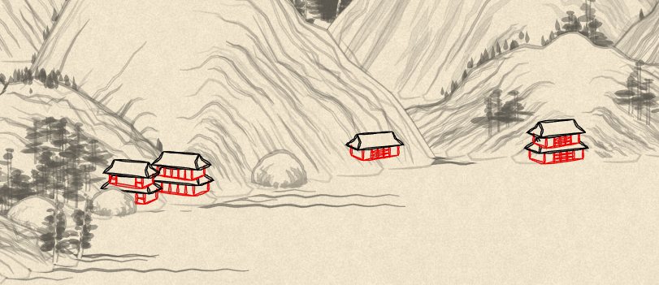

black - `deco`

red - `box`

#### arch03

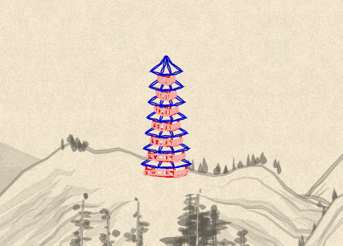

blue - `pagroof`

red - `box`

pink - `rail`

#### arch04

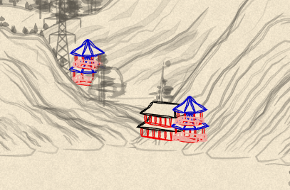

blue - `pagroot`

red - `box`

pink - `rail`

#### boat01

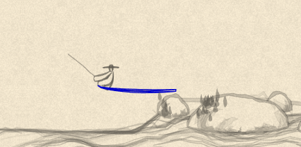

#### transmissionTower01

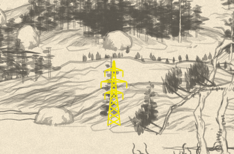

### tree

#### tree01

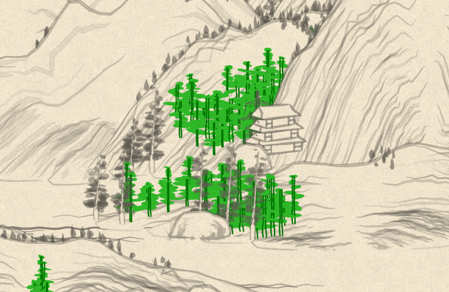

#### tree02

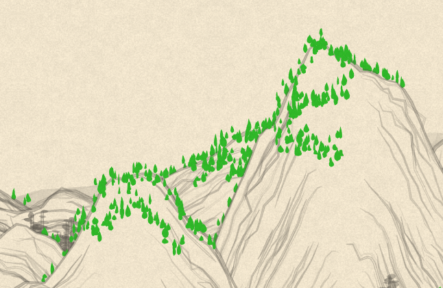

#### tree03

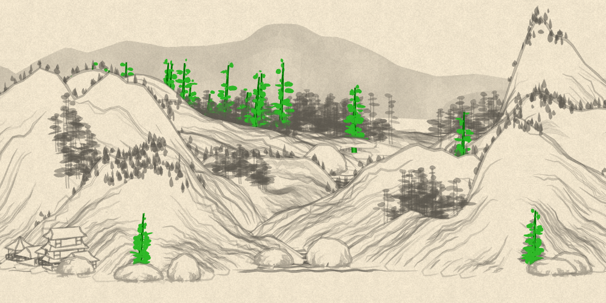

#### tree04

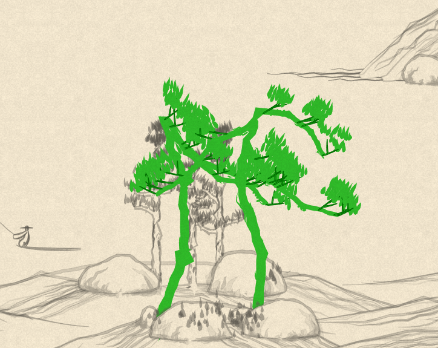

#### tree05

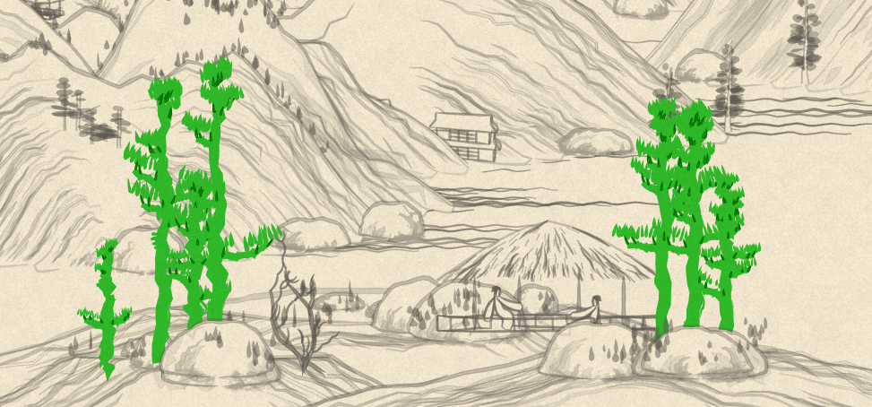

#### tree06

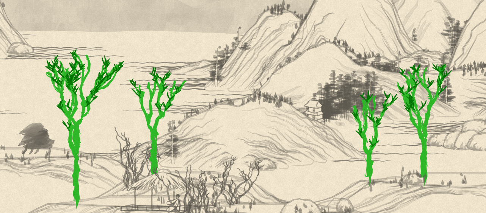

#### tree07

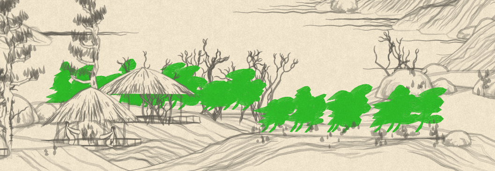

#### tree08

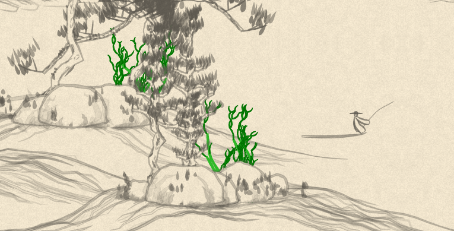

### mountain

#### mountain

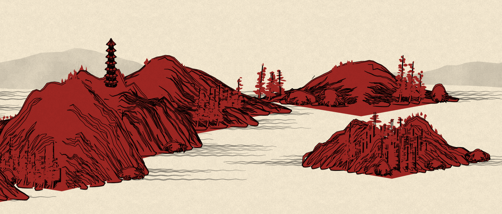

#### flatmountain

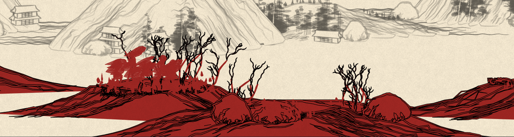

#### distmountain

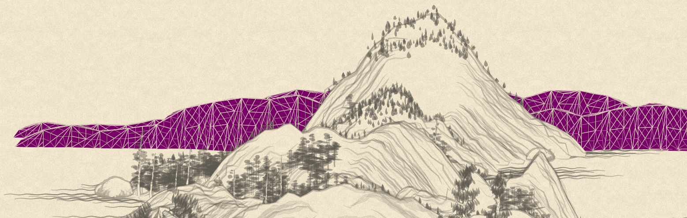

